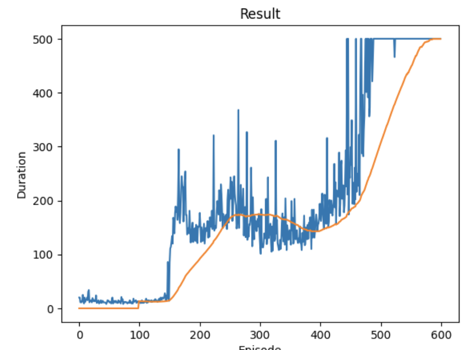
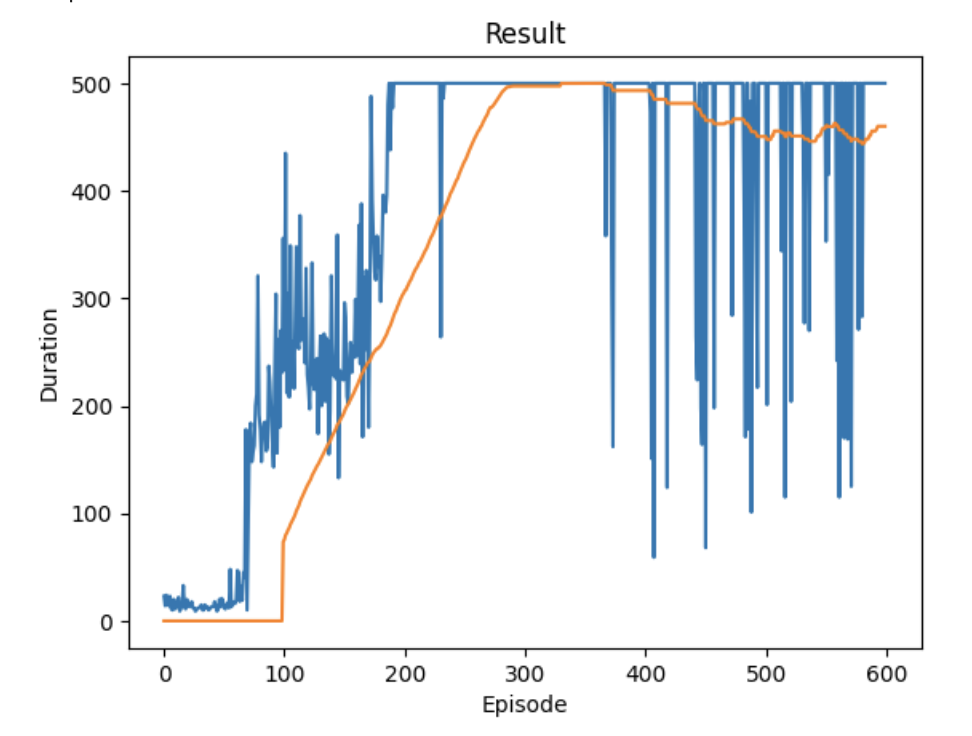
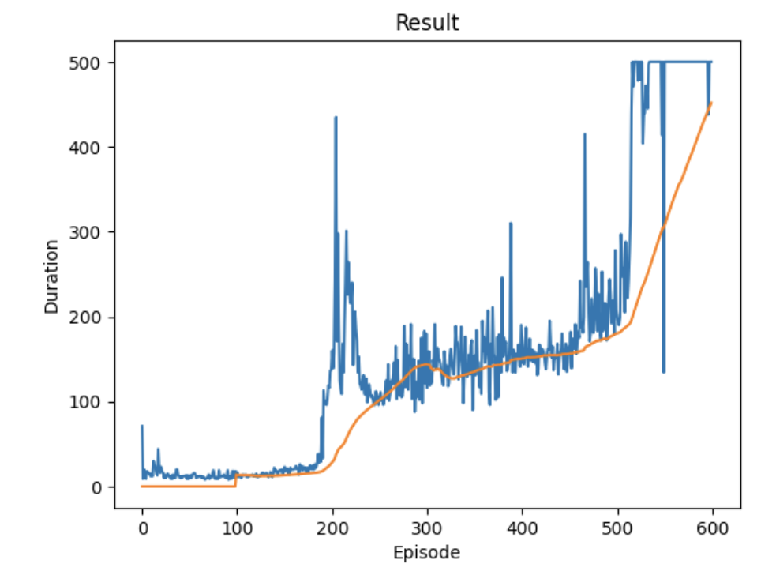
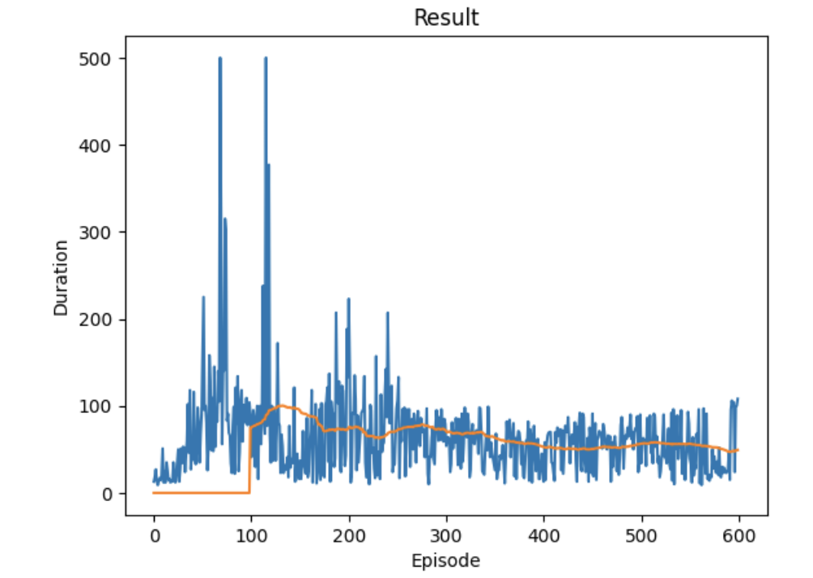

What was the first change you made to the model, and how did it affect the outcome?
What was the second change you made to the model, and how did it affect the outcome?
What was the third change you made to the model, and how did it affect the outcome?
How is the Epsilon value used in the training? Why does it "decay"?
Explain the purpose of the Gamma (𝛾) value.
 

Original Training Outcome:

 

1. The first change made to the model is the number of layers, it was modified from 128 to 256. The result was not satisfactory, although the model achieved 500 steps much faster than have less layers(128 originally) it was not constant and was much noisy before it started to stabilize again. Below is the outcome:

 

2. The second change made to the model is the batch size, it was modified from 128 to 64. The result was not satisfactory, although the model was updated more frequently, it took longer to achieve 500 steps. Below is the outcome:

 

3. The third change made to the model is the Learning rate, it was modified from 1e-4 to 1e-2. The result was not satisfactory, the model never converged and did not achieve 500 steps even after 600 episodes. Below is the outcome:

 

4. How is the Epsilon value used in the training? Why does it "decay"?

The epsilon value is used to set a select action, so that model sometimes chooses an action randomly rather than from a uniform distribution just to check if it is not missing anything. the value starts at a number and decays to a final value, the decay number decides how slow the decay rate should be. The decay is needed because once the model starts to refine there is no need to do the random exploration as it is in the start of training.

 

5. Explain the purpose of the Gamma (𝛾) value.

The Gamma (𝛾) value is the discount factor, it should be a constant between 0 and 1 to ensure the sum converges. A lower gamma makes rewards from the uncertain far future less important for our agent than the ones in the near future that it can be fairly confident about. It also encourages agents to collect reward closer in time than equivalent rewards that are temporally far away in the future.

 

 
